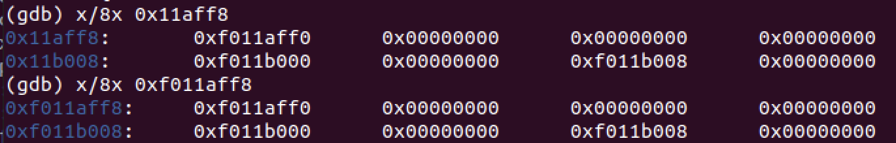
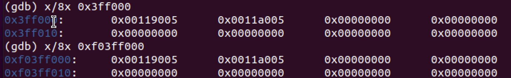

#

## page_free_list
[KERNBASE, KERNBASE+4M]已经映射至物理内存[0, 4M]


## Pages map
```
UPAGES:0xef000000
// page directory index
#define PDX(la)		((((uintptr_t) (la)) >> 22) & 0x3FF)
// page table index
#define PTX(la)		((((uintptr_t) (la)) >> 12) & 0x3FF)

PDX(UPAGES)=1110,1111,00=0x3BC=956
PTX(UPAGES)=(0xef000&0x3FF)=0

一级页表地址0xf0118000, UPAGES对应地址0xf01180ef0, 从page_free_list分配页0xf011aff8,对应物理地址0x3ff000

```

## upages mapping


```

```