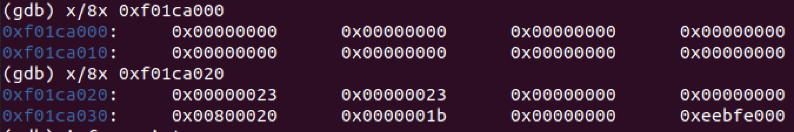
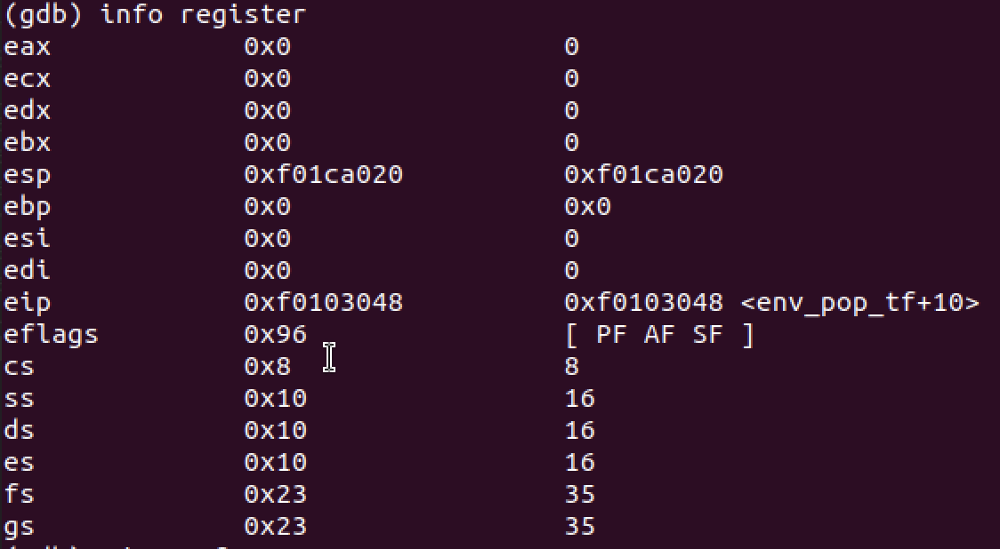
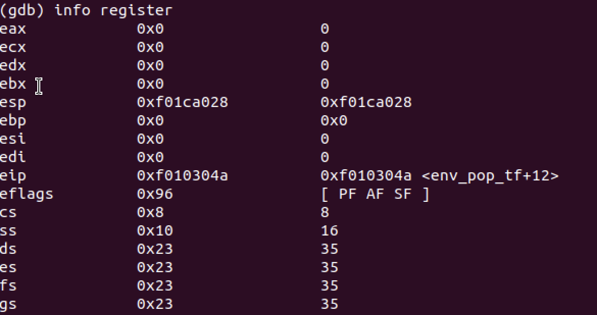
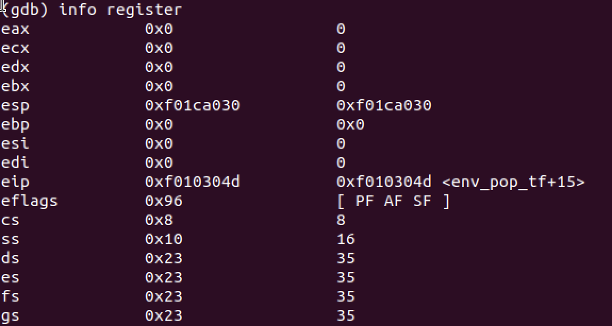
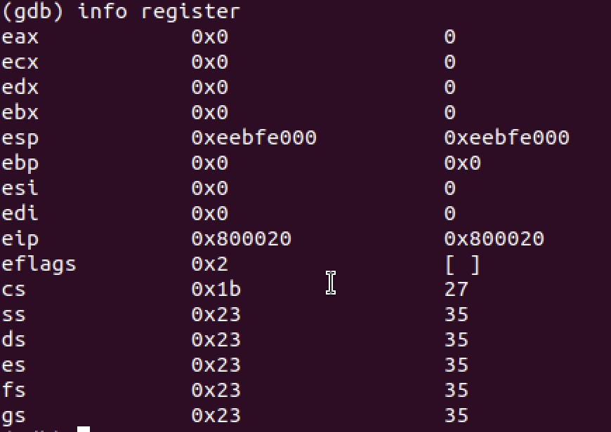
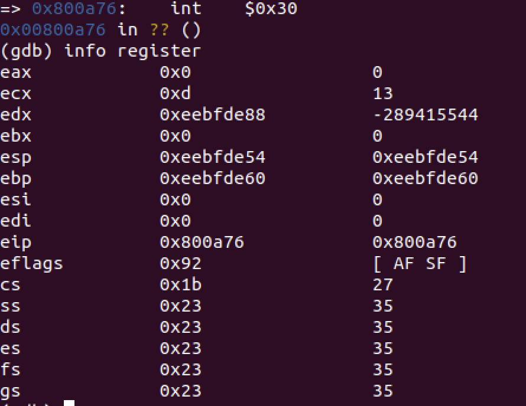
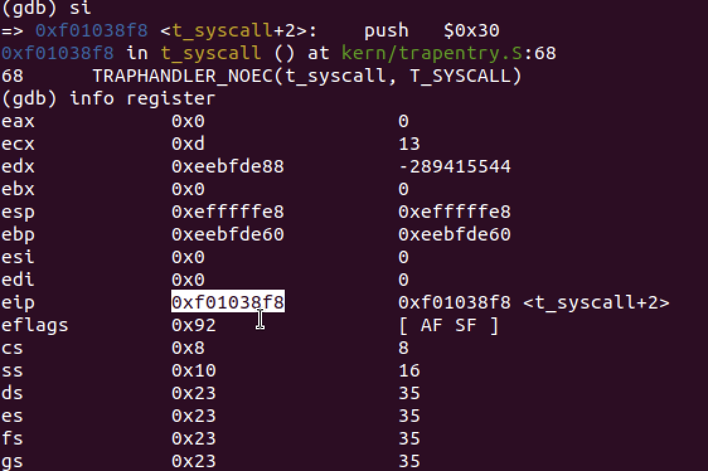
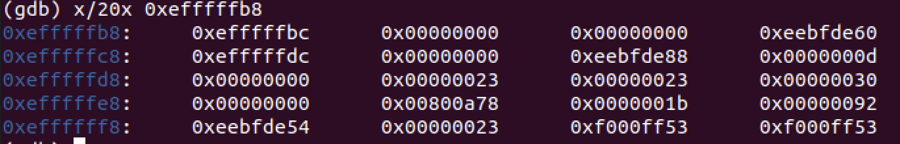

```
info register
b *0x...
x/8x 0x...
```

```
asm volatile( /* volatile : 可选，禁止编译器对汇编代码进行优化 */
  "汇编指令"   /* 汇编指令间使用'\n'分隔 */
  :"=限制符"(输出参数)
  :"限制符"(输入参数)
  :保留列表
)
```
(1) 关键字asm和volatile

asm为GCC关键字，表示接下来要嵌入汇编代码，如果asm与其他程序中的命名冲突，可以使用__asm__。

volatile为可选关键字，表示不需要对汇编代码做任何优化，类似的，也支持__volatile__

(2) 汇编指令

C语言中内联汇编代码必须用双引号将命令括起来，如果是多行汇编指令，则每条指令占用一行，每行指令用双引号括起来，以后缀\t\n结尾，\n表示newline的缩写，\t表示tab的缩写。

如示例代码：
```
asm volatile (
    "movl %eax, %ebx \n\t"
    "movl $100, %esi \n\t"
);
```
当使用拓展模式（包含output,input,clobbered部分），汇编指令中需要使用两个%来引用寄存器，比如%%rax；使用一个%来引用输入、输出参数，比如%1。

```
	asm volatile("movw %%ax,%%gs" : : "a" (GD_UD|3));  // "movl $23, %eax"   "movl %ax, %gs"
	asm volatile("movw %%ax,%%fs" : : "a" (GD_UD|3));  // "movl %ax, %fs"
	// The kernel does use ES, DS, and SS.  We'll change between
	// the kernel and user data segments as needed.
	asm volatile("movw %%ax,%%es" : : "a" (GD_KD)); // "movl $10, %ax" "movl %eax, %es"
	asm volatile("movw %%ax,%%ds" : : "a" (GD_KD)); // "movl %eax, %ds"
	asm volatile("movw %%ax,%%ss" : : "a" (GD_KD)); // "movl %eax, %ss"
	// Load the kernel text segment into CS.
	asm volatile("ljmp %0,$1f\n 1:\n" : : "i" (GD_KT)); // "ljmp $0x08, $0xf0102b1f
```

# 进程初始化
```
Below is a call graph of the code up to the point where the user code is invoked. Make sure you understand the purpose of each step.

start (kern/entry.S)
i386_init (kern/init.c)
  cons_init
  mem_init
  env_init
  trap_init (still incomplete at this point)
  env_create
  env_run
    env_pop_tf
```
before trap_init

when call i386_init, stack and ebp, esp, (boot stack not kernel stack or user stack)
```
ebp:0xf011,afd8
esp:0xf011,afd0
0xf011,b000: 0x0011,c021
0xf011,affc: 0xf010,003e // call i386_init push return address
0xf011,aff8: 0x0000,0000 // push %ebp, movl %esp, %ebp
0xf011,aff4:
0xf011,aff0:
0xf011,afec: // sub $0x0c, %esp
0xf011,afe8: // push %eax; 
0xf011,afe4: 0x0000,0000 // push $0
0xf011,afe0: 0xf01c,a000 // push 0xf01881d8(envs[0])
0xf011,afdc: 0xf010,009b // call env_pop_tf push return address
0xf011,afd8: 0xf011,aff8 // push %ebp; movl %esp, %ebp
0xf011,afd4: 
0xf011,afd0: // sub $0x08, %esp
0xf011,afcc:
0xf011,afc8:
0xf011,afc4: // sub $0x0c, %esp
0xf011,afc0: // push %eax
0xf011,afbc: 0xf0103091 // call env_pop_tf push return address
0xf011,afb8: 0xf011,afd8 // push %ebp; movl %esp, %ebp
0xf011,afb4:
0xf011,afb0:
0xf011,afac: // sub $0x0c, %esp; movl 8(%ebp), %esp; 4(%ebp) is return address, 8(%ebp) is paramater. so %esp=0xf01ca000
0xf011,afa8: 
0xf011,afa4:
0xf011,afa0:
```
```
env_pop_tf(struct Trapframe *tf)
{
	asm volatile(
		"\tmovl %0,%%esp\n" // 将esp指向envs结构体0xf01ca000
		"\tpopal\n" 
		"\tpopl %%es\n"
		"\tpopl %%ds\n"
		"\taddl $0x8,%%esp\n" /* skip tf_trapno and tf_errcode */
		"\tiret\n"
		: : "g" (tf) : "memory");
	panic("iret failed");  /* mostly to placate the compiler */
}
```
x/8x 0xf01c,a000的内容:


popal之后,如下图所示通用寄存器的值都为0了,且esp的值为0xf01c,a020

然后popl %es和popl %ds之后,寄存器ds和es的值为0x23,esp=0xf01c,a028

然后跳过tf_trapno and tf_errcode之后esp的值为0xf01c,a030

最后iret后,更新eip，esp以及eflags。寄存器都已经准备完毕，进入用户模式,esp也从bootstack跳转到用户栈


# 中断

在int 0x30指令执行之前寄存器的值如下:

在int 0x30指令执行之后寄存器的值如下:

执行int指令之后,esp寄存器已经指向了0xefff,ffe8。为什么不是0xf000,0000呢？因为需要把old SS, old ESP, old EFLAGS, old CS,old EIP,error code的值入栈

```
0xefff,fffc: old SS(0x23)
0xefff,fff8: old ESP(0xeebf,de54)
0xefff,fff4: old EFLAGS(0x92)
0xefff,fff0: old CS(0x1b)
0xefff,ffec: old EIP(0x800a78,指向int 0x30下一条指令地址)
0xefff,ffe8: error code(0x0)
```
继续执行__all_traps:
```
_alltraps:
	pushl %ds
	pushl %es
	pushal 

	movl $GD_KD, %eax
	movw %ax, %ds
	movw %ax, %es

	push %esp
	call trap
```
栈：
```
0xefff,ffe4: trap number (0x30)
0xefff,ffe0: %ds (0x23)
0xefff,ffdc: %es (0x23)
0xefff,ffd8: %eax (0x0)
0xefff,ffd4: %ecx (0xd)
0xefff,ffd0: %edx (0xeebfde88)
0xefff,ffcc: %ebx (0x0)
0xefff,ffc8: old esp (0xefff,ffdc)
0xefff,ffc4: %ebp (0xeebf,de60)
0xefff,ffc0: %esi (0x0)
0xefff,ffbc: %edi (0x0)
0xefff,ffb8: trap的形参:Trapframe结构体(0xefff,ffbc)
```


```
