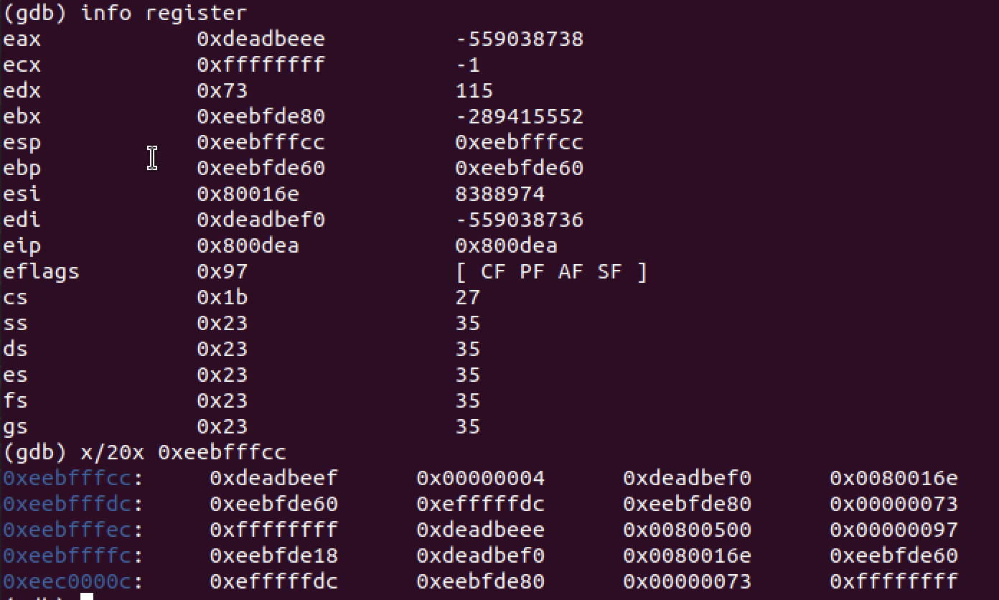
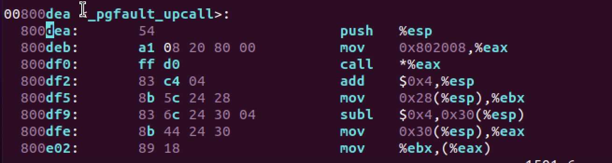
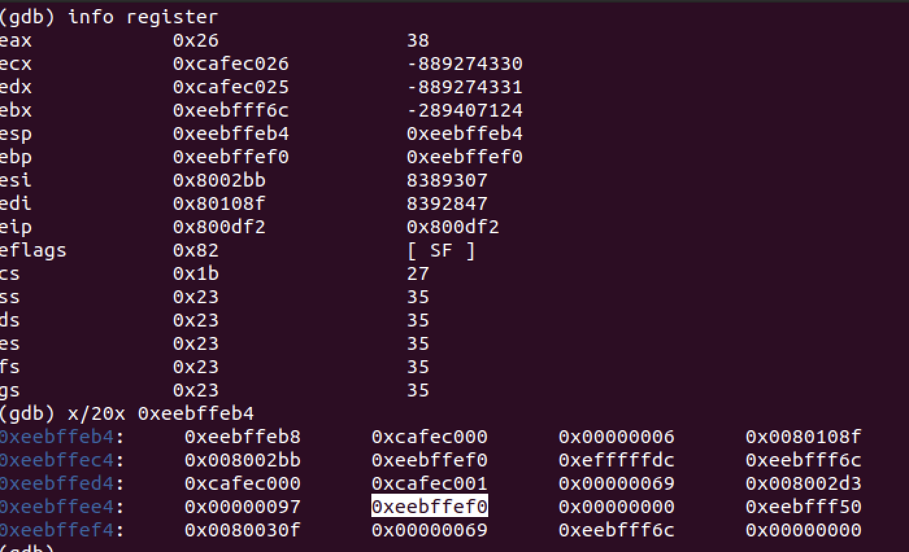

# Preemptive Multitasking


```
0xeec0,fffc: trap-time esp (0xeebfde18) [0xeebfd000, 0xeebfe000]用户栈 (after subl $0x4, 0x30(%esp), val is 0xeebfde14)
0xeebf,fff8:trap-time eflags (0x97)
0xeebf,fff4:trap-time eip (0x0080,0500)         (%esp+0x28)
0xeebf,fff0:trap-time eax (0xdead,beee)      start of struct PushRegs
0xeebf,ffec:trap-time ecx (-1)
0xeebf,ffe8:trap-time edx (0x73)
0xeebf,ffe4:trap-time ebx (0xeebf,de80)
0xeebf,ffe0:trap-time esp (0xefff,ffdc) (useless)
0xeebf,ffdc:trap-time ebp (0xeebf,de60) [0xeebfd000, 0xeebfe000]用户栈
0xeebf,ffd8:trap-time esi (0x0080,016e)
0xeebf,ffd4:trap-time edi (0xdead,bef0)      end of struct PushRegs
0xeebf,ffd0:tf_err (error code) (4)
0xeebf,ffcc:fault_va（0xdeadbeef)            <-- %esp when handler is run (after add $0x4, %esp, %esp is 0xeebf,ffcc)
0xeebf,ffc8:0xeebf,ffcc (push %esp)  (after hander function return, %esp is 0xeebf,ffc8
0xeebf,ffc4:0x0080,0df2 (call *%eax returun address)
0xeebf,ffc0:0xeebf,de60 (function hander: push %ebp, movl %esp, %ebp)
recursive 
...
0xeebf,fef0: 0xeebf,ff50
0xeebf,feec: 0x0 (after movl %ebx, (%eax), val is 0x0080,02d3)
0xeebf,fee8: (esp) (0xeebf,fef0)  %esp+0x30 （0xeebf,feec)
0xeebf,fee4: (eflags) (0x97)
0xeebf,fee0: (eip) (0x0080,02d3)  %esp+0x28
0xeebf,fedc: (eax) (0x69)
0xeebf,fed8: (ecx) (0xcafe,c0001)
0xeebf,fed4: (edx) (0xcafe,c000)
0xeebf,fed0: (ebx) (0xeebf,ff6c)
0xeebf,fecc: (esp) (0xefff,ffdc)
0xeebf,fec8: (ebp) (0xeebf,fef0)
0xeebf,fec4: (esi) (0x8002bb)
0xeebf,fec0: (edi) (0x80108f)
0xeebf,febc: (error code) (6)
0xeebf,feb8: (fault_va) 0xcafe,c000 <-- %esp when handler is run (after add $0x4, %esp, %esp is 0xeebf,feb8)
0xeebf,feb4: (0xeebf,feb8, push %esp) (after handler function return, %esp is 0xeebf,feb4)
```
1. 在异常栈中压入寄存器值记录出错状态，这些内容正好构成一个UTrapframe结构体，trap.c寄存器eip设置为env_pgfault_upcall保存的函数地址(0x800dea对应的就是_pgfault_call函数地址,定义在pfentry.S)，并且将堆栈切换到异常栈。esp=0xeebf,ffcc。然后运行页面错误处理函数在




```
push %esp // function argument: pointer to UTF
mov $0x802008, %eax // 0x802008是handler函数地址, 	movl _pgfault_handler, %eax
call *eax 
```
```
page_fault_handler => _pgfault_upcall => _pgfault_handler => 程序出错位置
```


```
movl 0x28(%esp), %ebx  // 获取用户进程页面错误时候的EIP,保存到%ebx寄存器中
subl $0x4, 0x30(%esp) // 将保存的栈值减去-4获得新位置
movl 0x30(%esp), %eax // 获取新的栈位置
movl %ebx, (%eax)   //  将eip的值保存到新的栈位置中
addl $0x8, %esp     // 跳过error_code, 指向0xeebf,fec0

popal // 然后将异常栈中存储的用户进程页面错误时的通用寄存器和eflags寄存器的值还原。
addl $0x4, %esp // 跳过eip，esp指向 0xeebf,fee0
popfl  

popl %esp // esp指向 0xeebf,fee8, popl执行后, esp=0xeebf,feec. 然后将异常栈中存储的esp的值还原到esp寄存器。

ret // 最后通过ret指令返回到用户进程出错时的地址继续执行。(ret指令执行的操作就是将弹出栈顶元素，并将EIP设置为该值，此时正好栈顶(0xeebf,feec)是我们在之前设置的出错时的EIP的值(0x0080,02d3)） ret之后，esp=0xeebf,fef0, eip=0x8002d3

现在可以看到如果发生嵌套页错误为什么多保留4个字节了，这是因为发生嵌套页错误时，此时我们的trap-time esp存储的是异常栈，此时会将trap-time的EIP的值会被设置到esp-4处，如果不空出4字节，则会覆盖原来的esp值了。
如果不是嵌套情况，trap-time esp存储的是用户栈，将trap-time的EIP的值设置到的是用户栈-4处（就是栈顶往下移4字节），因此不会有影响。
```

# IPC
ping-pong 

            id:1000                                                 id:1001
umain:
    fork()                                                               
    send 0 from 1000 to 1001                                            
    ipc_send(who, 0, 0, 0);(who=1001)                                   
ipc_send: 
    sys_ipc_try_send(to_env, val, pg, perm)
sys_ipc_try_send:
    if (!e->env_ipc_recving) return -E_IPC_NOT_RECV;                   
ipc_send: 
    ret = -E_IPC_NOT_RECV                                     
    sys_yield();                            ------->        umain:
                                                                if ((who = fork()) != 0) 
                                                                while: 
                                                                    uint32_t i = ipc_recv(&who, 0, 0);      
                                                            ipc_recv: 
                                                                sys_ipc_recv(pg);
                                                            sys_ipc_recv: 
                                                                set current env 
                                                                env_ipc_recving = 1;
                                                                env_status = ENV_NOT_RUNNABLE;
                                                                env_ipc_dstva = dstva;
ipc_send:                                   <-------            sys_yield();
    sys_ipc_try_send(to_env, val, pg, perm)
sys_ipc_try_send:
    set target 	
    e->env_ipc_recving = 0;                                 
    e->env_ipc_from = curenv->env_id; (1000)
    e->env_ipc_value = value; (0)
    e->env_status = ENV_RUNNABLE;
    e->env_tf.tf_regs.reg_eax = 0;
    return 0;
ipc_send: 
    ret = sys_ipc_try_send(to_env, val, pg, perm) = 0;
umain:
    while:
        uint32_t i = ipc_recv(&who, 0, 0);
ipc_recv: 
    sys_ipc_recv(pg);
sys_ipc_recv: 
    set current env 
    env_ipc_recving = 1;
    env_status = ENV_NOT_RUNNABLE;
    env_ipc_dstva = dstva;
    sys_yield()                             ------->    sys_ipc_recv: 
                                                            return 0;
                                                        ipc_recv:	
                                                            from_env = thisenv->env_ipc_from; (1000)
                                                            perm = thisenv->env_ipc_perm;
                                                            r = thisenv->env_ipc_value; (0)
                                                            if (from_env_store) *from_env_store = from_env;
                                                            if (perm_store) *perm_store = perm;
                                                            return r;
                                                        umain:
                                                            while:
                                                                cprintf:1001 got 0 from 1000
                                                                i++; // i = 1
                                                                ipc_send(who, i, 0, 0); // who = 1000, i = 1;
                                                        ipc_send:
                                                            sys_ipc_try_send(to_env, val, pg, perm)
                                                        sys_ipc_try_send:
                                                            set target
                                                            e->env_ipc_recving = 0;
                                                            e->env_ipc_from = curenv->env_id; (1001)
                                                            e->env_ipc_value = value; (1)
                                                            e->env_status = ENV_RUNNABLE;
                                                            e->env_tf.tf_regs.reg_eax = 0;
                                                            return 0;
                                                        ipc_send:
                                                            ret = sys_ipc_try_send(to_env, val, pg, perm) = 0
                                                        umain:
                                                            while:
                                                                uint32_t i = ipc_recv(&who, 0, 0);
                                                        ipc_recv:
                                                            sys_ipc_recv(pg);
                                                        sys_ipc_recv: 
                                                            set current env 
                                                            env_ipc_recving = 1;
                                                            env_status = ENV_NOT_RUNNABLE;
                                                            env_ipc_dstva = dstva;
sys_ipc_recv:                               <-------        sys_yield()
    return 0;           
ipc_recv:	
    from_env = thisenv->env_ipc_from; (1001)
    perm = thisenv->env_ipc_perm;
    r = thisenv->env_ipc_value; (1)
    if (from_env_store) *from_env_store = from_env;
    if (perm_store) *perm_store = perm;
    return r;
umain:
    while:
        cprintf:1000 got 1 from 1001
        i++; // i = 2
        ipc_send(who, i, 0, 0); // who = 1001, i = 2
icp_send:
    sys_ipc_try_send(to_env, val, pg, perm)
sys_ipc_try_send:
    set target
    e->env_ipc_recving = 0;
    e->env_ipc_from = curenv->env_id; (1000)
    e->env_ipc_value = value; (2)
    e->env_status = ENV_RUNNABLE;
    e->env_tf.tf_regs.reg_eax = 0;
    return 0;
ipc_send:
    ret = sys_ipc_try_send(to_env, val, pg, perm) = 0
umain:
    while:
        uint32_t i = ipc_recv(&who, 0, 0);
ipc_recv:
    sys_ipc_recv(pg);
sys_ipc_recv:
    set current env 
    env_ipc_recving = 1;
    env_status = ENV_NOT_RUNNABLE;
    env_ipc_dstva = dstva;
    sys_yield()                           ------->                  ...           